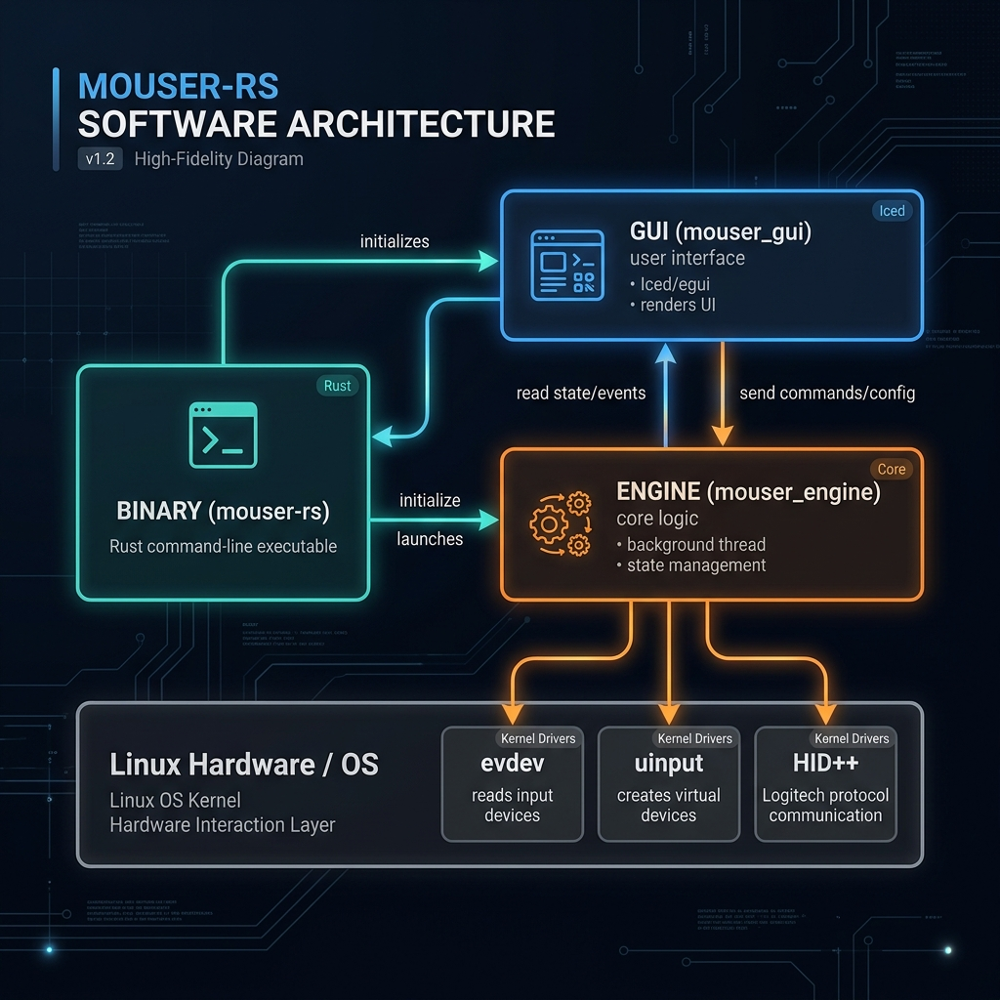
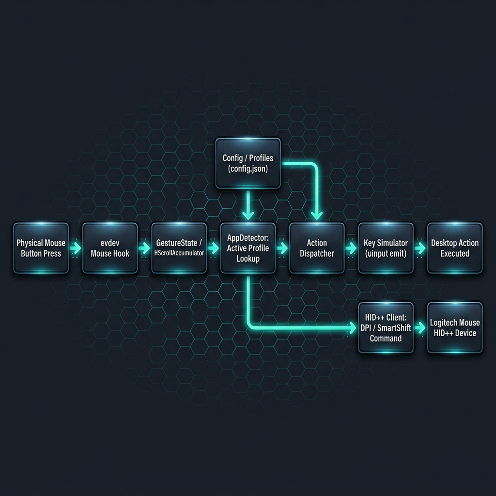

# Mouser-RS

> A native Linux daemon, CLI, and GUI for Logitech HID++ devices. Supports button remapping, multi-button gestures, DPI tuning, SmartShift, keyboard backlighting, application-based auto-switching, and cross-computer control (Logitech Flow). Written in Rust.

---

## Features

- **Daemon & gRPC Architecture**: Headless daemon (`mouser-rs --daemon`) running a background gRPC server over Unix domain sockets (`~/.config/Mouser/mouser_daemon.sock`). The GUI connects as a client and auto-spawns the daemon on launch if inactive.
- **Built-in CLI**: Scriptable subcommands (`status`, `profile`, `dpi`, `reload`) to query and control the daemon without opening the GUI.
- **Button Remapping & Gestures**: Map any mouse button to key combinations, media keys, or browser actions. Hold a button and swipe (Up / Down / Left / Right) for gesture actions. Supported on Physical Gesture button, Middle Click, Back (`xbutton1`), and Forward (`xbutton2`).
- **Logitech Flow (Cross-Computer Control)**:
  - Multi-machine control over LAN with UDP subnet discovery and TLS pairing.
  - Visual 3x3 grid screen arrangement.
  - Clipboard & file synchronization across systems.
  - Software virtual input emulation or hardware-level channel switching.
  - Guard key support (`Ctrl`, `Alt`, `Shift`) to prevent accidental screen transitions.
- **App-Specific Profiles**:
  - Automatic profile switching based on foreground window detection.
  - Compatible with X11, GNOME (`gdbus`), KDE (`kdotool`), Sway (`swaymsg`), Hyprland (`hyprctl`), i3 (`i3-msg`), and `xdotool` fallback.
  - Executable normalization (`-stable`, `-beta`, `-dev`) matching `/proc/*/exe` basenames with desktop app entries.
  - Built-in toast notifications on profile change.
- **Device Control**:
  - **DPI**: On-the-fly adjustment and persistence via HID++.
  - **SmartShift**: Toggle ratchet vs. free-spin scroll modes and threshold tuning.
  - **Backlight**: Control intensity and lighting patterns (Static, Breathing, Waves, Reaction, Random) for supported keyboards (e.g. MX Keys / MX Mechanical).
  - **Horizontal Scroll**: Tilt wheel remapping with configurable threshold and inversion.
- **System Integration**:
  - Wireless receiver (Unifying / Bolt) and direct Bluetooth support (via BlueZ).
  - System tray icon with restore/quit options.
  - Single-instance enforcement (second launch focuses existing window).
  - Automatic fallback to software rendering on WSL2.

---

## Architecture

### High-Level Architecture

```mermaid
graph TD
    classDef bin fill:#e3f2fd,stroke:#1565c0,stroke-width:2px,color:#0d47a1;
    classDef gui fill:#e8f5e9,stroke:#2e7d32,stroke-width:2px,color:#1b5e20;
    classDef engine fill:#fff3e0,stroke:#ef6c00,stroke-width:2px,color:#e65100;
    classDef os fill:#fafafa,stroke:#9e9e9e,stroke-dasharray: 5 5,color:#424242;

    subgraph App ["mouser-rs (Binary & CLI)"]
        Main["main.rs (CLI / Socket Guard / Daemon Launcher / Tray)"]
        CLI["cli.rs (CLI Parser & gRPC Stub Invoker)"]
    end
    class Main,CLI bin;

    subgraph GUI ["mouser_gui (egui Frontend)"]
        MouserApp["MouserApp (Root View)"]
        Theme["Theme & Styling"]
        Views["Views (Customization, Settings, Empty State)"]
        Widgets["Widgets (Battery, Status, Icons)"]
        DesktopApps["DesktopApps (Scanner & Icon Loader)"]
        Trans["Translation System (i18n)"]
        
        MouserApp --> Theme
        MouserApp --> Views
        MouserApp --> Trans
        Views --> Widgets
        Views --> DesktopApps
    end
    class MouserApp,Theme,Views,Widgets,DesktopApps,Trans gui;

    subgraph Engine ["mouser_engine (HID++ Backend & gRPC Server)"]
        Core["Engine Orchestrator (State, Gestures, Actions)"]
        Config["Config (JSON Persistence & Migrations)"]
        GRPC["gRPC Server & Tonic IPC Engine"]
        HIDPP["HID++ Client (Protocol, Queries, Button Diversion)"]
        BT["BlueZ Bluetooth Client"]
        Receiver["Unifying / Bolt Receiver Handler"]
        Input["Input Hook (evdev Interception & uinput Injection)"]
        AppDetect["AppDetector (X11 / Compositor Window Detectors)"]
        Flow["Logitech Flow Network Engine"]

        Core --> Config
        Core --> GRPC
        Core --> HIDPP
        Core --> BT
        Core --> Receiver
        Core --> Input
        Core --> AppDetect
        Core --> Flow
    end
    class Core,Config,GRPC,HIDPP,BT,Receiver,Input,AppDetect,Flow engine;

    subgraph OS ["Linux System Interfaces"]
        DevHID["/dev/hidraw* (Logitech Raw HID)"]
        DevInput["/dev/input/event* (evdev)"]
        UInput["/dev/uinput (Virtual Input Node)"]
        BlueZ["BlueZ D-Bus Daemon"]
        WindowSys["Windowing System (X11 / Wayland Compositors)"]
        UNIXSock["~/.config/Mouser/mouser_daemon.sock"]
    end
    class DevHID,DevInput,UInput,BlueZ,WindowSys,UNIXSock os;

    Main -->|Starts --daemon or connects to| GRPC
    CLI -->|gRPC Calls| GRPC
    Main -->|Launches egui| MouserApp
    MouserApp -->|Connects via EngineClient| GRPC
    
    HIDPP <-->|Read/Write HID++| DevHID
    Receiver <-->|Register Devices| DevHID
    BT <-->|D-Bus API| BlueZ
    Input <-->|evdev capture & uinput simulation| DevInput
    Input -->|Inject keystrokes| UInput
    AppDetect -->|Active Window Queries| WindowSys
    GRPC <-->|Unix Domain Socket| UNIXSock
```





---

### Component Overview

- **`mouser-rs` (`src/`)**: Binary entry point, argument parsing, single-instance socket lock, system tray, and CLI runner.
- **`mouser_engine` (`engine/`)**: Core logic crate housing:
  - `engine/`: Profile matching, gesture state evaluation, action dispatching, and hotplug monitoring.
  - `hidpp/`: Raw HID++ 1.0/2.0+ protocol implementation and device feature enumeration.
  - `input/`: Kernel `evdev` interception and `uinput` virtual input emulation.
  - `detection/`: Window active process resolution for X11, GNOME, KDE, Sway, Hyprland, and i3.
  - `flow.rs`: Cross-computer input redirection and clipboard synchronization protocol.
  - `grpc.rs`: Tonic gRPC service server handling IPC from GUI and CLI clients.
- **`mouser_gui` (`gui/`)**: Immediate-mode UI built with `egui` and `eframe`:
  - Visual layout configuration for mouse buttons, gesture directions, scroll behavior, and profile bindings.
  - Desktop application scanning (`.desktop` files) and icon texture caching.
  - Theme customization and localization engine.

---

### Runtime Event Pipeline



1. **Hardware Press**: Mouse button press intercepted by **evdev Mouse Hook**.
2. **Gesture & Scroll Check**: **GestureState** and **HScrollAccumulator** evaluate whether event is a click, scroll, or swipe.
3. **App Context**: **AppDetector** identifies current active window and fetches matching profile.
4. **Action Resolution**: **Action Dispatcher** looks up configured action mapping for current profile.
5. **Key Injection**: **Key Simulator** emits virtual key or button events via `/dev/uinput`.
6. **Device Control (Parallel)**: DPI / SmartShift / Backlight actions send HID++ frames directly to `/dev/hidraw*`.

---

### Codebase Structure

```
mouse/
├── src/                                 # Binary entry point & CLI parser
│   ├── main.rs                          # Entry point, CLI dispatcher, GUI launcher
│   ├── cli.rs                           # CLI subcommand handlers
│   ├── gui.rs                           # GUI execution runner
│   ├── signal.rs                        # Unix signal handling (SIGINT/SIGTERM)
│   ├── single_instance.rs               # Single-instance socket guard
│   └── tray.rs                          # System tray menu integration
├── engine/                              # mouser_engine backend library
│   └── src/
│       ├── battery.rs                   # HID++ battery status reader
│       ├── bluetooth.rs                 # BlueZ D-Bus Bluetooth client
│       ├── cache.rs                     # Paired device cache on disk
│       ├── client.rs                    # gRPC client client stub
│       ├── config.rs                    # JSON configuration parser & serializer
│       ├── flow.rs                      # Logitech Flow network & clipboard engine
│       ├── grpc.rs                      # Tonic gRPC IPC server
│       ├── receiver.rs                  # Unifying & Bolt receiver handler
│       ├── worker.rs                    # Async task executor
│       ├── engine/                      # State coordinator & dispatch loop
│       ├── hidpp/                       # HID++ protocol driver & diversion
│       ├── input/                       # evdev interception & uinput simulator
│       └── detection/                   # Per-compositor window detectors
├── gui/                                 # mouser_gui egui frontend
│   └── src/
│       ├── desktop_apps.rs              # System application & process scanner
│       ├── icon_loader.rs               # .desktop icon extractor & texture cache
│       ├── theme.rs                     # Design tokens & color harmonies
│       ├── translation.rs               # i18n localization support
│       ├── app/                         # Main eframe application & views framework
│       ├── views/                       # Button, gesture, setting, & landing views
│       └── widgets/                     # Battery gauge, status pills, custom icons
└── packaging/                           # Linux distribution & udev rules
    └── linux/
        ├── 69-mouser-logitech.rules     # Udev rules for /dev/hidraw and /dev/uinput access
        ├── install-linux-permissions.sh # Permission setup script
        └── build-deb.sh                 # Debian package (.deb) builder script
```

---

## Technical Specifications

| System Area | Implementation Strategy |
|---|---|
| **IPC Protocol** | Tonic gRPC over Unix Domain Sockets (`~/.config/Mouser/mouser_daemon.sock`) |
| **CLI Dispatch** | Light std::env parsing matching commands against gRPC client stubs |
| **Input Synthesis** | Linux `uinput` virtual device driver |
| **Hardware Hooks** | Exclusive `evdev` grabbing (`/dev/input/event*`) with fallback handling |
| **Device Access** | Raw `/dev/hidraw*` via `hidapi` crate using Logitech HID++ 1.0 & 2.0+ packets |
| **App Detection** | Composite polling engine (X11 Xlib, GNOME D-Bus, KDE `kdotool`, Sway `swaymsg`, Hyprland `hyprctl`, i3 `i3-msg`) |
| **Concurrency** | Lock-free hot paths, `Arc<Mutex<T>>` guarded state with aggressive lock dropping prior to IO |

---

## Requirements

### System Dependencies

| Dependency | Purpose |
|---|---|
| **Linux OS** | Kernel supporting `evdev` and `uinput` |
| **Rust ≥ 1.75** | Toolchain for compiling Cargo workspace |
| `libhidapi-dev` | HID++ communication over `/dev/hidraw*` |
| `libudev-dev` | Hardware device enumeration |
| `libgtk-3-dev` / `libglib2.0-dev` | System tray & GTK event integration |
| `pkg-config` | Build-time dependency resolver |

Install required packages on Debian / Ubuntu:

```sh
sudo apt update
sudo apt install libhidapi-dev libudev-dev libgtk-3-dev libglib2.0-dev pkg-config build-essential
```

---

## Linux Permissions Setup

Mouser-RS requires access to `/dev/hidraw*` and `/dev/uinput`. To run without root privileges:

```sh
cd packaging/linux
sudo sh install-linux-permissions.sh
```

This installs `/etc/udev/rules.d/69-mouser-logitech.rules`, reloads udev rules, loads the `uinput` kernel module, and grants permissions to the `input` and `plugdev` user groups. Reconnect your mouse after installation.

---

## Building & Installation

### Cargo Build

```sh
# Development build
cargo build

# Optimized release build (LTO enabled, stripped binary)
cargo build --release
```

The output binary is produced at `target/release/mouser-rs`.

### Building Debian Package (.deb)

```sh
cd packaging/linux
./build-deb.sh
```

Generates `mouser-rs_0.1.0_amd64.deb` in the project root. Install using `dpkg`:

```sh
sudo dpkg -i mouser-rs_0.1.0_amd64.deb
```

---

## Usage & CLI Reference

### Running the Application

```sh
# Launch GUI (starts daemon automatically if not running)
mouser-rs

# Launch headless daemon mode
mouser-rs --daemon

# Enable debug logging
mouser-rs --debug
```

### CLI Subcommands

```sh
mouser-rs status            # Print daemon status, device specs, active profile, DPI
mouser-rs profile list      # List all profiles in the active group
mouser-rs profile get       # Display currently active profile
mouser-rs profile set <name># Switch to target profile (e.g. 'global' or 'Brave Web Browser')
mouser-rs dpi get           # Display configured DPI value
mouser-rs dpi set <value>   # Set DPI (e.g. 800, 1000, 1600, 3200)
mouser-rs reload            # Force daemon to reload ~/.config/Mouser/config.json
mouser-rs help              # Show CLI help documentation
```

---

## Configuration

Configuration is saved at:

```
~/.config/Mouser/config.json
```

Daemon Unix domain socket:

```
~/.config/Mouser/mouser_daemon.sock
```

Logs are written to:

```
~/.config/Mouser/logs/
```

### Minimal Config Example

```jsonc
{
  "version": 12,
  "active_group": "default",
  "active_app_profile": "global",
  "profile_groups": {
    "default": {
      "profiles": {
        "global": {
          "label": "Default (All Apps)",
          "apps": [],
          "mappings": {
            "xbutton1": "alt_tab",
            "xbutton2": "browser_back",
            "hscroll_left": "browser_back",
            "hscroll_right": "browser_forward"
          }
        }
      }
    }
  },
  "settings": {
    "dpi": 1000,
    "smart_shift_enabled": true,
    "smart_shift_mode": "ratchet",
    "smart_shift_threshold": 25,
    "gesture_threshold": 50,
    "gesture_deadzone": 40,
    "language": "en"
  }
}
```

---

## Troubleshooting

### Device Detection / HID++ Failures
- Ensure `69-mouser-logitech.rules` is installed and active.
- Verify user membership in `input` and `plugdev` groups:
  ```sh
  sudo usermod -aG input,plugdev $USER
  ```
- Unplug and reconnect the USB receiver or toggle Bluetooth.

### Keyboard / Input Interception Conflicts
- `mouser-rs` grabs keyboard input nodes via `evdev` to process custom remappings. If running alongside tools like `Keyd`, `Kmonad`, or `Solaar`, conflicts over exclusive grabs may arise. Ensure only one tool grabs the specific input node.

---

## License

Distributed under the MIT License. See [LICENSE](LICENSE) for details.
