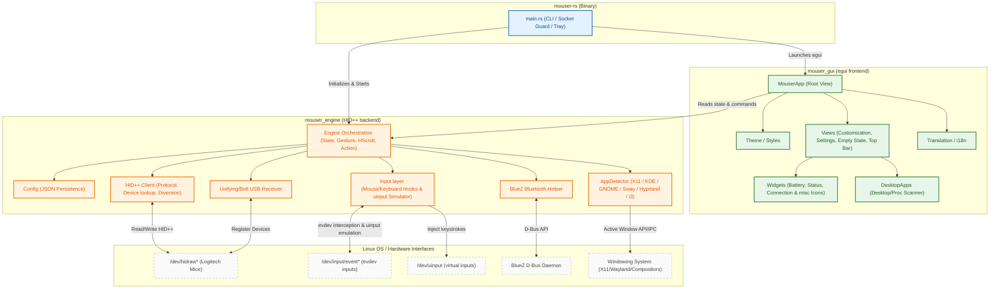
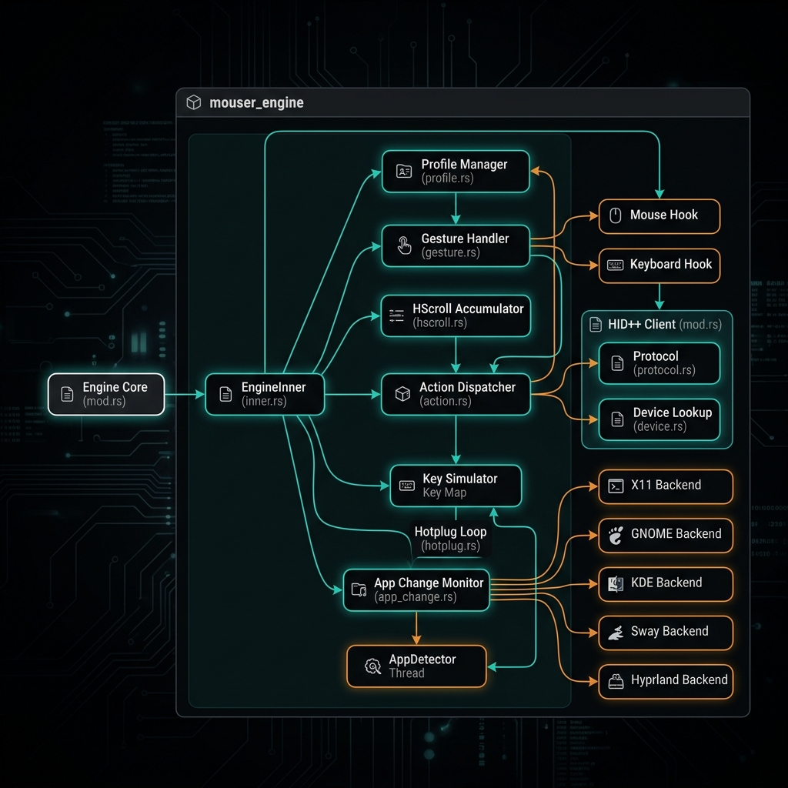
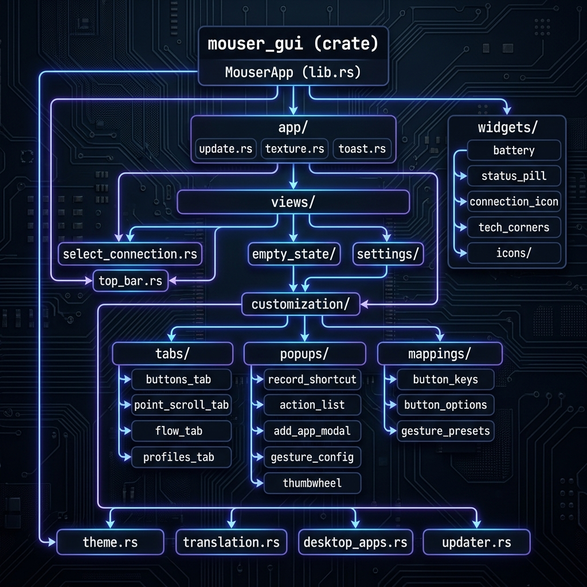

# Mouser-RS

> A native Linux daemon and GUI for Logitech HID++ mice: button remapping, gesture control, DPI tuning, SmartShift, and more. Written in Rust.

---

## Features

- **Button Remapping** - Map any mouse button to keyboard shortcuts, media keys, browser actions, or custom key sequences. Features an interactive recording UI supporting arbitrary key combinations (with fallback injection for system copy/cut/paste events).
- **Multi-Button Gesture Control** - Hold a button and swipe in a direction (up / down / left / right) to trigger configurable actions. Gestures are supported on the physical gesture button, Middle Click (`middle`), Side Button 1 / Back (`xbutton1`), and Side Button 2 / Forward (`xbutton2`). Includes configurable threshold, deadzone, timeout, and cooldown.
- **Application Profiles** - Multiple named profiles with automatic process-based switching.
  - **Auto-Switching** - Automatically detects the active foreground app window. Supports native X11 plus compositor/shell-specific fallbacks for GNOME Shell (via D-Bus `gdbus`), KDE Plasma & LXQt (via `kdotool`), Sway (via `swaymsg`), Hyprland (via `hyprctl`), i3 (via `i3-msg`), and legacy/general desktop environments (via `xdotool`).
  - **In-App Application Selector** - Scans installed applications (from `.desktop` files in `/usr/share/applications` and `~/.local/share/applications`) and active processes (via `/proc`) to create app-specific profiles in one click.
  - **Toast Notifications** - Displays modern, animated, and fading toast alerts at the bottom-right corner of the screen when the active profile changes.
- **DPI Control** - Set and persist DPI directly via the HID++ protocol.
- **SmartShift** - Toggle and tune Logitech's SmartShift (free-spin ↔ ratchet scroll wheel) threshold.
- **Horizontal Scroll** - Map horizontal scroll tilt to browser Back / Forward or any key combo. Configurable threshold and inversion.
- **Vertical Scroll Inversion** - Optionally invert the scroll wheel direction.
- **Battery Monitor** - Real-time battery level display in the GUI for wireless mice.
- **Bluetooth & USB Receiver** - Supports devices connected via a Logitech Unifying / Bolt receiver or directly over Bluetooth.
- **Persistent Device Cache** - Paired devices are remembered across Bluetooth disconnections. Connection state updates live; devices never disappear from the GUI just because BT is off.
- **System Tray** - Minimize to system tray; restore or quit from the tray menu.
- **Single Instance** - Launching a second instance brings the existing window to front instead of starting a duplicate process.
- **Auto-updater** - Built-in update checker with optional automatic install.
- **Multi-language UI** - Translation system with per-locale string files.
- **WSL2 Compatible** - Automatically falls back to software rendering when running under WSL2.

---

## Architecture

### High-Level Overview


The project is a Cargo workspace with three crates: the `mouser-rs` binary (entry point, tray, single-instance guard), the `mouser_engine` backend library (HID++, evdev hooks, uinput simulator, gesture engine, AppDetector), and the `mouser_gui` egui frontend.



---

### Engine Module Map



The `mouser_engine` crate is split into four module groups:

- **`engine/`** — Core orchestration: `EngineInner`, profile management, gesture state machine, horizontal scroll accumulator, action dispatcher, hotplug loop, and app-change monitor.
- **`hidpp/`** — HID++ wire protocol: raw request/response, device path lookup, feature detection, and button diversion control.
- **`input/`** — evdev interception (mouse hook, keyboard hook) and uinput-based key/click/scroll emulation (simulator + key map).
- **`detection/`** — Per-compositor active window detection: `thread.rs` worker + dedicated backends for X11, GNOME, KDE/LXQt, Sway, Hyprland, i3, and generic xdotool fallback.

---

### GUI Module Map



The `mouser_gui` crate is organized as:

- **`app/`** — `MouserApp` struct, eframe update loop, texture cache, and toast notification engine.
- **`views/`** — All rendered panels:
  - `customization/` — Button remapping tabs, gesture config popups, action list, shortcut recorder, thumbwheel popup, and button/gesture/key mapping helpers.
  - `settings/` — Language, theme, profile, and update settings panels.
  - `empty_state/` — Connection prompt and device card when no mouse is detected.
- **`widgets/`** — Reusable draw primitives: battery indicator, status pill, connection icon, tech-corner decoration, and icon sets.
- **`theme.rs`** / **`translation.rs`** / **`desktop_apps.rs`** / **`updater.rs`** — Shared services used across all views.

---

### Runtime Event Flow


How a physical mouse button press becomes a desktop action:

1. **Physical button press** → captured by the **evdev Mouse Hook**
2. → **GestureState / HScrollAccumulator** — determines if this is a gesture, scroll, or plain click
3. → **AppDetector** — resolves the active application window and selects the matching profile from `config.json`
4. → **Action Dispatcher** — looks up the mapped action for the button in the active profile
5. → **Key Simulator (uinput emit)** — injects the corresponding key combo or mouse event into the OS
6. → **Desktop action executed** ✓

A parallel path handles DPI / SmartShift changes: `Action Dispatcher` → **HID++ Client** → Logitech device over `/dev/hidraw*`.

---

### Codebase Tree

```
mouse/
├── src/               # Binary entry point (main.rs)
│   └── main.rs        # CLI args, single-instance guard, engine init, GUI launch, tray
├── engine/            # mouser_engine - HID++ backend library
│   └── src/
│       ├── lib.rs          # Module declarations and public API re-exports
│       ├── engine/         # Engine core orchestration, state, gesture handlers, profiles
│       ├── hidpp/          # HID++ wire protocol client, device query, and button diversion
│       ├── input/          # evdev hooks (mouse/keyboard) and uinput simulator
│       ├── detection/      # Active window foreground detection (X11 & Wayland backends + worker thread)
│       ├── bluetooth.rs    # BlueZ D-Bus helpers, device discovery
│       ├── receiver.rs     # Unifying / Bolt USB receiver support
│       ├── battery.rs      # Battery polling via HID++
│       ├── cache.rs        # Persistent paired-device cache (survives BT off)
│       ├── config.rs       # Config / Profile / Settings data structures + JSON persistence
│       └── worker.rs       # Thread-pool helpers & state updater
└── gui/               # mouser_gui - egui frontend library
    └── src/
        ├── lib.rs          # App structure and main frame entry points
        ├── app/            # Main update loops, textures, and toast notifications
        ├── views/          # Specific panel layouts: customization settings, empty connection states, settings panels, navigation top bar
        ├── widgets/        # Drawing widgets: battery levels, status pills, corner accents, specialized icon grids
        ├── theme.rs        # Design tokens (colors, typography, spacing, window size)
        ├── translation.rs  # i18n string lookup
        ├── desktop_apps.rs # Installed app (.desktop) & running process scanner
        └── updater.rs      # HTTP update checker & installer
```

### Key design decisions

| Concern | Approach |
|---|---|
| Backend / GUI isolation | `mouser_engine` is a plain library; `mouser_gui` depends on it but never the reverse. |
| Thread safety & responsiveness | `Engine` wraps `Arc<EngineInner>`. Mutable state lives in `Mutex` or atomic registers. Locks are aggressively dropped before invoking external commands or executing blocking actions. |
| Config hot-reload | `Engine::reload_config()` picks up a freshly-written `config.json` without restart. |
| Device persistence | `cache.rs` writes paired devices to disk; GUI reads from cache, not from live BT query. |
| Single instance | Unix domain socket at `~/.config/Mouser/mouser.sock`; second launch sends `SHOW` and exits. |
| App detection & caching | `AppDetector` queries X11 or compositor/shell-specific fallbacks (GNOME, KDE/LXQt, Sway, Hyprland, i3, or general X11). Missing CLI dependencies (e.g. `gdbus`, `kdotool`, `swaymsg`, `hyprctl`, `i3-msg`, `xdotool`) are cached as disabled upon first failure to eliminate overhead and log spam. |
| Deadlock-free gestures | Multi-button gestures use a single `GestureState` mutex with lock-free atomic hot-paths and explicit mutex release blocks prior to executing mapped actions. |
| Non-blocking keyboard hook | Interceptors for Logitech keyboards use `poll` on event file descriptors with timeouts instead of spinning/would-block loops, drastically reducing CPU usage. |
| Clipboard shortcut recording | System copy, cut, and paste events intercepted by egui are mapped back to their corresponding keys, with platform-specific modifiers (`ctrl` or `meta`) auto-injected if missing to bypass OS-level event stripping. |


## Requirements

| Dependency | Notes |
|---|---|
| Linux (X11 / XWayland) | Wayland dynamic window hiding not supported by winit; XWayland is used automatically. |
| Rust ≥ 1.75 | Stable toolchain |
| `libhidapi-dev` | HID++ communication |
| `libudev-dev` | evdev / uinput |
| `libgtk-3-dev` | System tray support |
| `pkgconf` / `pkg-config` | Build-time dependency resolution |

Install build dependencies on Debian/Ubuntu:

```sh
sudo apt install libhidapi-dev libudev-dev libgtk-3-dev pkg-config build-essential
```

---

## Linux Permissions Setup

Mouser-RS reads HID raw devices and synthesises input events via `uinput`. Without the correct udev rules these nodes are only accessible as root.

Run the bundled installer **once** (after building) to install the rules without needing to run the app as root:

```sh
cd packaging/linux
sudo sh install-linux-permissions.sh
```

This copies `69-mouser-logitech.rules` to `/etc/udev/rules.d/`, reloads udev, and loads the `uinput` kernel module. Reconnect your mouse after the script completes.

---

## Building

```sh
# Development build
cargo build

# Optimised release build (LTO, strip, abort-on-panic)
cargo build --release
```

The binary is placed at `target/release/mouser-rs`.

---

## Running

```sh
# Launch GUI (default)
./target/release/mouser-rs

# Enable verbose debug logging
./target/release/mouser-rs --debug

# Headless daemon mode (no GUI, no tray)
./target/release/mouser-rs --daemon

# Show help
./target/release/mouser-rs --help
```

Launching a second instance while one is already running will bring the existing window to the foreground instead of opening a duplicate.

---

## Configuration

Settings are persisted to:

```
~/.config/Mouser/config.json
```

Logs are written to the platform log directory (typically `~/.local/share/Mouser/` or `~/.config/Mouser/`) and rotated at 5 MB, keeping the five most recent files.

### Config structure overview

```jsonc
{
  "version": 11,
  "active_profile": "default",
  "profiles": {
    "default": {
      "label": "Default (All Apps)",
      "apps": [],
      "mappings": {
        "middle": "none",
        "middle_gesture_enabled": "true",
        "middle_gesture_left": "none",
        "middle_gesture_right": "none",
        "middle_gesture_up": "none",
        "middle_gesture_down": "none",
        "gesture": "none",
        "gesture_enabled": "true",
        "gesture_left": "none",
        "gesture_right": "none",
        "gesture_up": "none",
        "gesture_down": "none",
        "xbutton1": "alt_tab",
        "xbutton1_gesture_enabled": "true",
        "xbutton1_gesture_left": "none",
        "xbutton1_gesture_right": "none",
        "xbutton1_gesture_up": "none",
        "xbutton1_gesture_down": "none",
        "xbutton2": "alt_tab",
        "xbutton2_gesture_enabled": "true",
        "xbutton2_gesture_left": "none",
        "xbutton2_gesture_right": "none",
        "xbutton2_gesture_up": "none",
        "xbutton2_gesture_down": "none",
        "hscroll_left": "browser_back",
        "hscroll_right": "browser_forward",
        "mode_shift": "switch_scroll_mode"
      }
    }
  },
  "settings": {
    "start_minimized": true,
    "start_at_login": false,
    "hscroll_threshold": 1,
    "invert_hscroll": false,
    "invert_vscroll": false,
    "dpi": 1000,
    "smart_shift_mode": "ratchet",
    "smart_shift_enabled": false,
    "smart_shift_threshold": 25,
    "gesture_threshold": 50,
    "gesture_deadzone": 40,
    "gesture_timeout_ms": 3000,
    "gesture_cooldown_ms": 500,
    "appearance_mode": "system",
    "debug_mode": false,
    "device_layout_overrides": {},
    "language": "en",
    "ignore_trackpad": true,
    "accent_color": "#8b5cf6",
    "install_updates": true
  }
}
```

---

## License

This project is private / proprietary. All rights reserved.
