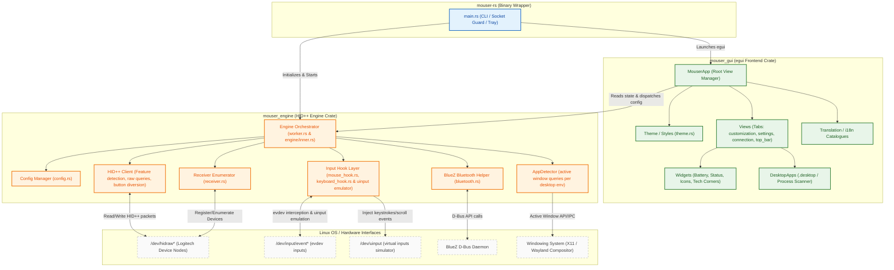

# Mouser-RS

> A native Linux daemon and GUI for Logitech HID++ mice: button remapping, gesture control, DPI tuning, SmartShift, and more. Written in Rust.

---

## Table of Contents
1. [Overview](#overview)
2. [Key Features](#key-features)
3. [Tech Stack](#tech-stack)
4. [Prerequisites](#prerequisites)
5. [Getting Started](#getting-started)
   - [1. Install Dependencies](#1-install-dependencies)
   - [2. Clone the Repository](#2-clone-the-repository)
   - [3. Build the Application](#3-build-the-application)
   - [4. Set Linux Permissions](#4-set-linux-permissions)
   - [5. Run the Application](#5-run-the-application)
   - [6. Set Up Systemd Daemon Service](#6-set-up-systemd-daemon-service)
6. [Architecture & Design](#architecture--design)
   - [High-Level Architecture](#high-level-architecture)
   - [Crate Structure](#crate-structure)
   - [Codebase File Tree](#codebase-file-tree)
   - [Event Lifecycle Flow](#event-lifecycle-flow)
   - [Key Design Decisions](#key-design-decisions)
7. [Configuration Reference](#configuration-reference)
   - [Config file parameters](#config-file-parameters)
   - [JSON Configuration Example](#json-configuration-example)
8. [CLI Reference](#cli-reference)
9. [Testing](#testing)
10. [Troubleshooting](#troubleshooting)
11. [License](#license)

---

## Overview

**Mouser-RS** is a feature-rich, high-performance input remapping suite and Logitech hardware utility designed specifically for Linux. It combines a low-overhead background daemon that communicates directly with Logitech mice via the HID++ protocol and intercepts input events via `evdev`, with a modern, hardware-accelerated GUI built in `egui`. 

Mouser-RS allows you to customize your mouse buttons, configure complex directional swiping gestures, sync clipboards across multiple computers (Logitech Flow), create application-aware settings profiles, adjust hardware parameters like DPI and SmartShift scroll-wheel friction, and even control keyboard backlighting.

---

## Key Features

### 🖱️ Button Remapping & Macro Injection
- Map any mouse button (including middle click, side back/forward buttons, gesture buttons, and scroll tilts) to keyboard shortcuts, media keys, browser navigation, or custom key combinations.
- Uses an interactive recording UI inside the GUI that registers arbitrary combinations.
- Features custom event injection fallbacks for system copy/cut/paste triggers to ensure compatibility across client applications.

### 🔄 Multi-Button Gesture Control
- Hold down a mapped trigger button and swipe the mouse in any of the four cardinal directions (Up, Down, Left, Right) to trigger configurable actions.
- Gestures can be mapped to Middle Click (`middle`), the physical thumb gesture button (`gesture`), Side Button 1 (`xbutton1`), or Side Button 2 (`xbutton2`).
- Tune physical parameters per profile: gesture distance threshold (in pixels), deadzone size, swipe timeout (ms), and gesture cooldown (ms).

### 🖥️ Logitech Flow (Cross-Computer Control)
- Seamlessly transition your mouse cursor and keyboard focus between multiple computers on your local network.
- **Visual Grid Arrangement:** Position machines relative to one another in a 3x3 layout (Left, Right, Top, Bottom) via a visual drag-and-drop arranger.
- **Subnet Auto-Discovery:** Discovers peer instances via UDP broadcasts and establishes secure TLS-encrypted transport channels.
- **Switching Modes:** Supports both instant virtual cursor injection (software routing via peer daemon inputs) or physical hardware-level channel switching (triggering Logitech mouse channel state updates).
- **Clipboard & File Sharing:** Clipboard contents (text, raw PNG images, and files) are synced automatically across machines over TCP. Files are written to temporary caches and inserted as standard URI lists.
- **Transition Guarding:** Option to require holding a modifier key (`Ctrl`, `Alt`, `Shift`) to transition screens, preventing accidental switches.
- **Wayland Resolution Mapping:** Handles coordinate scaling across multi-monitor setups with varying resolutions and scaling factors.

### 📱 Application-Aware Profiles
- Define separate button, gesture, DPI, and keyboard backlighting settings that activate automatically depending on the focused window.
- Scans installed `.desktop` files from `/usr/share/applications` and `~/.local/share/applications` and lists active processes (`/proc`) via an interactive UI list.
- Supports native X11 window queries and compositors/shells: GNOME Shell (via D-Bus `gdbus`), KDE Plasma & LXQt (via `kdotool`), Sway (via `swaymsg`), Hyprland (via `hyprctl`), i3 (via `i3-msg`), and general fallback query clients (via `xdotool`).
- Strictly checks unique executable mappings to prevent overlapping configuration conflicts, with real-time UI validation warnings.

### 💡 Keyboard Backlight Control
- Configure and manage backlighting on supported Logitech keyboards (such as MX Keys and MX Mechanical series).
- Set default backlight state, brightness levels, and apply animation patterns: Static, Contrast, Breathing, Waves, Reaction, and Random.
- Re-applies configuration settings upon device reconnection and active profile switches.

### 🎛️ Hardware & Sensor Tuning
- Adjust and persist sensor DPI directly via HID++ protocol calls.
- Configure and trigger Logitech's SmartShift scroll wheel (toggle automatic free-spin vs tactile ratchet scrolling) and set its sensitivity threshold.
- Invert vertical scroll wheel directions or configure horizontal scroll-wheel tilt behavior.

### 🛠️ Core Daemon Integrations
- **System Tray:** Minimizes to the desktop system tray; provides quick menus to restore the window, toggle daemon state, or exit.
- **Single Instance Socket:** Guarantees only one instance of Mouser-RS runs per user session. Launching a secondary instance automatically brings the existing window to the foreground.
- **Device Connection Persistence:** Remembers paired devices via a persistent local cache. UI connection status updates dynamically without removing disconnected devices from the UI.
- **WSL2 Compatibility:** Automatically falls back to software rendering (rendering via CPU/egui fallbacks) when running inside Windows Subsystem for Linux 2.

---

## Tech Stack

| Component | Technology | Description |
|---|---|---|
| **Core Language** | [Rust](https://www.rust-lang.org/) | Memory-safe, high-performance systems programming language. |
| **GUI Framework** | [egui](https://github.com/emilk/egui) / [eframe](https://docs.rs/eframe/latest/eframe/) | Immediate-mode, highly responsive, hardware-accelerated UI framework. |
| **Input Hooking** | [evdev](https://crates.io/crates/evdev) | Linux kernel input event interface wrapper. |
| **Input Emulation** | `/dev/uinput` | Linux virtual input device driver simulator. |
| **Logitech Communication** | HID++ via `/dev/hidraw*` | Direct reading/writing of raw Logitech HID++ protocol packets. |
| **Bluetooth / DBus** | [BlueZ](https://www.bluez.org/) via [zbus](https://crates.io/crates/zbus) | Peer bluetooth lookup and desktop D-Bus signaling. |
| **Asynchronous Engine** | [Tokio](https://tokio.rs/) | Multi-threaded asynchronous runtime. |
| **Networking** | TLS over TCP/UDP | Broadcast subnet discovery and secure peer event transmissions. |

---

## Prerequisites

Before building or running Mouser-RS, ensure you have the following system libraries installed on your machine.

### System Libraries
- **HIDAPI:** For raw communication with HID devices.
- **UDEV:** For device hotplug detection and evdev events.
- **GTK3 & GLib:** For native system tray and context menu rendering.
- **Pkg-config:** For build-time dependency resolution.
- **C Compiler:** For compiling native dependencies.

Install these dependencies on major distributions:

#### Debian / Ubuntu
```bash
sudo apt update
sudo apt install libhidapi-dev libudev-dev libgtk-3-dev libglib2.0-dev pkg-config build-essential
```

#### Arch Linux
```bash
sudo pacman -S hidapi libudev-0-shim gtk3 glib2 pkgconf base-devel
```

#### Fedora
```bash
sudo dnf install hidapi-devel systemd-devel gtk3-devel glib2-devel pkgconf-pkg-config make gcc
```

### Network Ports (For Logitech Flow)
If using Logitech Flow cross-computer controls, ensure the following ports are allowed through your system firewall (e.g., UFW or Firewalld):
- **UDP Port `50519`**: For local subnet auto-discovery broadcasts.
- **TCP Port `50520`**: For secure TLS control sessions and clipboard synchronizations.

For UFW users:
```bash
sudo ufw allow 50519/udp
sudo ufw allow 50520/tcp
```

---

## Getting Started

### 1. Clone the Repository
```bash
git clone https://github.com/soulr27/mouse.git
cd mouse
```

### 2. Build the Application
Ensure you have the Rust stable toolchain installed (Rust $\ge$ 1.75 is required).

```bash
# Build optimized development binary
cargo build

# Build production release binary (enables LTO, stripping, and abort on panic)
cargo build --release
```
The compiled binaries are placed under `target/debug/mouser-rs` and `target/release/mouser-rs`.

### 3. Set Linux Permissions
Mouser-RS requires access to raw Logitech devices under `/dev/hidraw*` and must be able to inject simulated inputs via `/dev/uinput`. To run Mouser-RS without administrative privileges (`root`), configure the custom udev rules:

```bash
# Navigate to the packaging directory and execute the permissions helper
cd packaging/linux
sudo sh install-linux-permissions.sh
```

**What this script does:**
1. Installs [69-mouser-logitech.rules](file:///home/soulr27/mouse/packaging/linux/69-mouser-logitech.rules) to `/etc/udev/rules.d/`. These rules apply the `uaccess` tag to matching Logitech USB receiver nodes, Bluetooth input event nodes, and the virtual `/dev/uinput` node, granting session focus read/write permissions to the logged-in desktop user.
2. Ensures the `uinput` kernel module is loaded (`modprobe uinput`).
3. Reloads and triggers the new udev rules (`udevadm control --reload-rules && udevadm trigger`).

*Note: Unplug and reconnect your Logitech mouse receiver (or toggle Bluetooth) for the new permissions rules to apply.*

### 4. Run the Application
Start the application from the project root:

```bash
# Run GUI application (default)
./target/release/mouser-rs

# Run in Daemon Mode (runs headless in the background without UI or tray)
./target/release/mouser-rs --daemon

# Run with verbose debug logging to stdout and files
./target/release/mouser-rs --debug
```

### 5. Set Up Systemd Daemon Service
To run Mouser-RS automatically as a background daemon whenever your user session starts, install the user systemd service:

```bash
# Copy systemd unit file to your user config directory
mkdir -p ~/.config/systemd/user
cp packaging/linux/mouser.service ~/.config/systemd/user/

# Reload the systemd daemon config for user services
systemctl --user daemon-reload

# Enable and start the service
systemctl --user enable --now mouser.service
```

To view daemon logs:
```bash
journalctl --user -u mouser.service -f
```

---

## Architecture & Design

### High-Level Architecture

Mouser-RS is divided into a background engine coordinator, a hardware-accelerated frontend GUI, and a CLI/Tray entry wrapper.



### Crate Structure
Mouser-RS uses a Cargo workspace comprising three key crates:
1. **`app` (`mouser-rs`)**: The executable wrapper. Handles system arguments, starts the background logger, manages the single-instance Unix domain socket lock, sets up OS interrupt signals, and instantiates the desktop system tray icon.
2. **`engine` (`mouser_engine`)**: The logic center. Intercepts physical event files (`evdev`), evaluates button state machines for gestures, matches events to application profiles, writes raw bytes directly to mouse feature routes, and spins up local servers for Flow synchronizations.
3. **`gui` (`mouser_gui`)**: The layout representation. Compiles widgets and styling definitions, performs desktop application lookups, handles system shortcut recording inputs, and queries user preferences.

### Codebase File Tree

The workspace is organized as follows:

```
mouse/                                       // Project Workspace Root
├── Cargo.toml                               // Workspace dependencies and settings
├── src/                                     // Binary wrapper source
│   ├── main.rs                              // CLI parsing, logger initiation, daemon/GUI spawning
│   ├── gui.rs                               // Bridge executing the egui frontend loops
│   ├── signal.rs                            // OS signal hook registry (SIGINT/SIGTERM)
│   ├── single_instance.rs                   // UDS socket guard preventing duplicate processes
│   └── tray.rs                              // Desktop system tray builder and event handler
├── engine/                                  // mouser_engine crate
│   ├── Cargo.toml                           // Engine crate dependencies
│   └── src/
│       ├── lib.rs                           // Module exports & Tokio initialization
│       ├── battery.rs                       // HID++ Battery voltage & level queries
│       ├── bluetooth.rs                     // BlueZ helper managing wireless discovery
│       ├── cache.rs                         // Local paired device database
│       ├── config.rs                        // Configuration schema, persistence & profiles rules
│       ├── receiver.rs                      // Logitech Bolt/Unifying USB receiver handlers
│       ├── worker.rs                        // Engine update loops & background thread manager
│       ├── lock_ext.rs                      // Synchronization helpers
│       ├── engine/                          // Engine coordination core
│       │   ├── mod.rs                       // Lifecycle control loops & profile reloaders
│       │   ├── action.rs                    // Desktop key action mapping interpreter
│       │   ├── app_change.rs                // Focused application change notifier
│       │   ├── gesture.rs                   // Gesture recognition tracking state machine
│       │   ├── hotplug.rs                   // Raw and BT connection change listener
│       │   ├── hscroll.rs                   // Horizontal wheel tilt scroll aggregator
│       │   ├── inner.rs                     // Central engine state container (Arc wrapped)
│       │   └── profile.rs                   // Profile validation & match engines
│       ├── hidpp/                           // HID++ protocol implementation
│       │   ├── mod.rs                       // Logitech capability lookups
│       │   ├── device.rs                    // RAW file query handles & event readers
│       │   ├── diversion.rs                 // HID++ button redirection control
│       │   └── protocol.rs                  // Packet structural headers & parses
│       ├── input/                           // Event interception loops
│       │   ├── mod.rs                       // Input thread controllers
│       │   ├── keyboard_hook.rs             // Keyboard modifier state listener
│       │   ├── mouse_hook.rs                // Raw mouse device hook (evdev)
│       │   └── simulator/                   // Virtual input injector
│       │       ├── mod.rs                   // Virtual device file descriptor writer
│       │       ├── actions.rs               // Keystroke emulation helper
│       │       ├── emit.rs                  // Raw event emission interfaces
│       │       ├── key_map.rs               // Key symbol to evdev keycode translations
│       │       └── mouse_map.rs             // Mouse button maps
│       └── detection/                       // Foreground focus window trackers
│           ├── mod.rs                       // Window focus listener coordinator
│           ├── thread.rs                    // Active window poll loop
│           ├── fallbacks.rs                 // Environment detection heuristics
│           ├── x11.rs                       // X11 active window collector
│           ├── gnome.rs                     // GNOME Shell D-Bus focus detector
│           ├── kde.rs                       // KDE focus client utilizing kdotool
│           ├── sway.rs                      // Sway IPC window observer
│           ├── hyprland.rs                  // Hyprland socket focus consumer
│           ├── i3.rs                        // i3 focus observer via i3-msg
│           └── xdotool.rs                   // Generic legacy desktop fallback tool
├── gui/                                     // mouser_gui crate
│   ├── Cargo.toml                           // GUI crate dependencies
│   └── src/
│       ├── lib.rs                           // GUI entry & application loops
│       ├── desktop_apps.rs                  // Desktop entry & proc scanners
│       ├── theme.rs                         // Colors, accent tokens, and styles
│       ├── translation.rs                   // i18n string maps and lookup catalogues
│       ├── updater.rs                       // Automatic update check & download client
│       ├── app/                             // Main views wrapper
│       │   ├── mod.rs                       // eframe context loops & toast handlers
│       │   ├── texture.rs                   // Graphical resource loader
│       │   ├── toast.rs                     // Popup alerts rendering loops
│       │   └── update.rs                    // Layout assembly components
│       ├── views/                           // UI layout panels
│       │   ├── mod.rs                       // Active view selector
│       │   ├── select_connection.rs         // First run & connection screen
│       │   ├── top_bar.rs                   // Toolbar controls & status headers
│       │   ├── empty_state/                 // Connection missing banners
│       │   │   ├── mod.rs                   // Placeholder layout wrapper
│       │   │   └── device_card.rs           // Properties card for active mouse
│       │   ├── settings/                    // Preferences screens
│       │   │   ├── mod.rs                   // Navigation list
│       │   │   ├── section_language.rs      // System localization settings
│       │   │   ├── section_profiles.rs      // Application mappings manager
│       │   │   ├── section_theme.rs         // Visual styling parameters
│       │   │   └── section_updates.rs       // Auto updates configuration
│       │   └── customization/               // Button configuration tabs
│       │       ├── mod.rs                   // Grid layout wrapper
│       │       ├── sidebar.rs               // Layout category list
│       │       ├── mappings/                // Shortcuts control panel
│       │       │   ├── mod.rs               // Shortcut lists wrapper
│       │       │   ├── button_keys.rs       // Interactive button configurations
│       │       │   ├── button_options.rs    // Bindable actions list
│       │       │   └── gesture_presets.rs   // Directional preset library
│       │       ├── popups/                  // Dialogue models
│       │       │   ├── mod.rs               // Modals state manager
│       │       │   ├── action_list.rs       // Searchable bindings lists
│       │       │   ├── add_app_modal.rs     // Active apps catalog lists
│       │       │   ├── gesture_config.rs    // Direction swiping mapping layout
│       │       │   ├── record_shortcut.rs   // Keyboard event recorder canvas
│       │       │   └── thumbwheel.rs        // Scroll configuration options
│       │       └── tabs/                    // Tab controls
│       │           ├── mod.rs               // Tab pages container
│       │           ├── buttons_tab.rs       // Physical button actions editor
│       │           ├── flow_tab.rs          // Flow networks editor
│       │           ├── point_scroll_tab.rs  // DPI settings and wheel speed
│       │           └── profiles_tab.rs      // Context profile rules lists
│       └── widgets/                         // Reusable custom widgets
│           ├── mod.rs                       // UI element exports
│           ├── battery.rs                   // Battery charging capsule widget
│           ├── connection_icon.rs           // BLE / USB status symbol
│           ├── status_pill.rs               // Dynamic state text label indicators
│           ├── tech_corners.rs              // Neon layout corner brackets
│           └── icons/                       // SVG vectors path definitions
│               ├── mod.rs                   // Icons collection index
│               ├── connection_icons.rs      // Dongles and Bluetooth badges
│               ├── misc_icons.rs            // Navigational & editor elements
│               ├── settings_icons.rs        // Panel categories illustrations
│               └── sidebar_icons.rs         // Side layout identifiers
└── packaging/                               // Packaging resources
    └── linux/
        ├── 69-mouser-logitech.rules         // Raw device and uinput permission configurations
        ├── install-linux-permissions.sh     // Rules compilation setup script
        ├── PKGBUILD                         // Arch Linux packaging script
        ├── mouser.desktop                   // Desktop environment application entry
        ├── mouser.service                   // Systemd user background service
        └── mouser.spec                      // RPM spec packaging definition
```

### Event Lifecycle Flow

Every physical mouse interaction is processed through the following pipeline:

```
[Physical Mouse Press]
        │
        ▼ (Intercepted by evdev hook on /dev/input/event*)
[evdev Mouse Hook]
        │
        ├──► [Gesture Detector] ──► Mapped Gesture? ──► [Action Dispatcher] ──┐
        │                                                                     │
        ├──► [HScroll Accumulator] ─► Mapped Tilt? ───► [Action Dispatcher] ──┤
        │                                                                     │
        └──► Normal Button? ──────────────────────────► [Action Dispatcher] ──┤
                                                                              │
                                                                              ▼
                                                                  [Active App Profile]
                                                                              │ (Resolved by AppDetector)
                                                                              ▼
                                                                  [Key/Mouse Simulator]
                                                                              │ (Emitted via /dev/uinput)
                                                                              ▼
                                                                   [Desktop Action Run]
```

1. **Input Interception:** The physical button press is captured at the kernel level by the **evdev Mouse Hook** before it reaches standard desktop event handlers.
2. **Gesture & Tilt Resolution:** If the button is held, the `GestureState` machine tracks cursor displacement coordinates. If coordinates cross the distance threshold, it resolves as a swipe gesture (Up/Down/Left/Right). Scroll wheel tilt inputs are passed to the `HScrollAccumulator`.
3. **App Focus Matching:** The `AppDetector` updates the active profile dynamically based on focused application name scans.
4. **Action Evaluation:** The `Action Dispatcher` matches the resolved trigger to the active profile configuration.
5. **Action Emulation:** The virtual key simulator writes evdev events directly to `/dev/uinput`, triggering the mapped key sequences or macros in the operating system.

### Key Design Decisions

| Category | Decision | Rationale |
|---|---|---|
| **Separation of Concerns** | Crate Isolation | The `mouser_engine` acts as a pure backend crate with no graphical dependencies, meaning it can run headless under low CPU overhead in `--daemon` mode. The `mouser_gui` crate depends on it only to read state and submit config updates. |
| **Concurrency Model** | Mutex Isolation | The engine state container (`EngineInner`) is wrapped in an `Arc`. Heavy operations (running desktop checks, network transmissions, or external shell executions) release locks aggressively beforehand to prevent interface or input thread blocking. |
| **System Event Grabs** | Exclusive evdev Grabs | Evdev grabs the mouse interface exclusively. If buttons are diverted, original clicks are suppressed, preventing the raw button press from firing desktop actions while a gesture macro is executing. |
| **Hot Reheating** | JSON Config Reloader | The configuration file can be overwritten directly. Calling `Engine::reload_config()` parses the updated JSON schema on-the-fly, reloading bindings without requiring a service reboot. |
| **Bluetooth Persistence** | Device State Caching | Paired Bluetooth devices write records to a persistent local cache file. The GUI loads status from the cache, ensuring devices stay listed rather than disappearing whenever Bluetooth cycles or enters power saving. |
| **Detection Optimizations** | Cache Missing Helpers | Focused window utilities check desktop system requirements once. If a tool (like `swaymsg` or `xdotool`) is missing, further checks are skipped and cached as disabled, preventing overhead and avoiding log pollution. |

---

## Configuration Reference

Settings, profile definitions, and macros are persisted to:
```bash
~/.config/Mouser/config.json
```

### Config File Parameters

| Key | Type | Default | Description |
|---|---|---|---|
| `version` | Integer | `12` | Schema version indicator. Used to migrate old files. |
| `active_group` | String | `"default"` | Active profile group. |
| `active_app_profile` | String | `"global"` | Active process focus profile rule identifier. |
| `settings.start_minimized` | Boolean | `true` | When true, starts the application minimized to the system tray. |
| `settings.start_at_login` | Boolean | `false` | When true, installs an autostart desktop entry for the user session. |
| `settings.dpi` | Integer | `1000` | Hardware sensor resolution (DPI value). |
| `settings.smart_shift_enabled` | Boolean | `false` | Enable/disable Logitech SmartShift scroll wheel toggles. |
| `settings.smart_shift_threshold` | Integer | `25` | Friction sensitivity threshold triggering scroll wheel spin shift. |
| `settings.gesture_threshold` | Integer | `50` | Number of pixels the cursor must travel to trigger a swipe gesture. |
| `settings.gesture_deadzone` | Integer | `40` | Deadzone radius (pixels) where swipes are ignored. |
| `settings.gesture_timeout_ms` | Integer | `3000` | Timeout after which a held gesture is aborted. |
| `settings.gesture_cooldown_ms` | Integer | `500` | Delay between consecutive gesture activations. |
| `settings.appearance_mode` | String | `"system"` | Visual UI theme (`"system"`, `"light"`, or `"dark"`). |
| `settings.accent_color` | String | `"#8b5cf6"` | Hex color string for UI highlighting. |
| `settings.flow_enabled` | Boolean | `false` | Enable/disable Flow cross-computer controls. |
| `settings.flow_local_name` | String | `"Computer"` | Network name broadcasted by this machine. |
| `settings.flow_hold_key` | String | `"none"` | Modifier key required to cross screen edges (`"none"`, `"ctrl"`, `"alt"`, or `"shift"`). |
| `settings.flow_mouse_mode` | String | `"software"` | Cursor switching mode (`"software"` redirection or `"hardware"` channel toggles). |

### JSON Configuration Example

```json
{
  "version": 12,
  "active_group": "default",
  "active_app_profile": "global",
  "profile_groups": {
    "default": {
      "profiles": {
        "global": {
          "label": "Default (All Apps)",
          "apps": [],
          "mappings": {
            "middle": "none",
            "middle_gesture_enabled": "true",
            "middle_gesture_left": "none",
            "middle_gesture_right": "none",
            "middle_gesture_up": "none",
            "middle_gesture_down": "none",
            "gesture": "none",
            "gesture_enabled": "true",
            "gesture_left": "workspace_left",
            "gesture_right": "workspace_right",
            "gesture_up": "workspace_up",
            "gesture_down": "workspace_down",
            "xbutton1": "copy",
            "xbutton2": "paste",
            "hscroll_left": "browser_back",
            "hscroll_right": "browser_forward"
          }
        }
      }
    }
  },
  "settings": {
    "start_minimized": true,
    "start_at_login": false,
    "hscroll_threshold": 1,
    "invert_hscroll": false,
    "invert_vscroll": false,
    "dpi": 1200,
    "smart_shift_mode": "ratchet",
    "smart_shift_enabled": true,
    "smart_shift_threshold": 30,
    "gesture_threshold": 60,
    "gesture_deadzone": 30,
    "gesture_timeout_ms": 2500,
    "gesture_cooldown_ms": 400,
    "appearance_mode": "dark",
    "accent_color": "#8b5cf6",
    "flow_enabled": false,
    "flow_local_name": "Primary Desktop",
    "flow_peers": [],
    "flow_screen_width": 1920,
    "flow_screen_height": 1080,
    "flow_hold_key": "ctrl",
    "flow_mouse_mode": "software",
    "flow_keyboard_linking": true
  }
}
```

---

## CLI Reference

Mouser-RS provides the following CLI flags for execution configuration:

```
Mouser Rust Linux Daemon
Usage: mouser-rs [options]

Options:
  -d, --debug    Enable debug level logging and print messages to console.
  --daemon       Run headless in the background without UI or system tray.
  -h, --help     Show this help message.
```

---

## Testing

Mouser-RS comes with a comprehensive test suite covering configuration deserialization, input translation, and window focus tracking.

```bash
# Run all tests in the workspace (includes engine unit tests and integration tests)
cargo test

# Run tests specifically for the engine backend
cargo test --package mouser_engine

# Run tests specifically for the GUI frontend
cargo test --package mouser_gui

# Run a specific test matching a search term
cargo test --package mouser_engine config::tests::test_config_serialization
```

*Note: Some input hook tests require uinput permissions setup to run successfully.*

---

## Troubleshooting

### 🔴 Mouse Not Detected / Permissions Error
Mouser-RS needs raw write permissions to access HID properties under `/dev/hidraw*` and simulate virtual events using `/dev/uinput`.

**Solutions:**
1. Check if the udev rules are loaded:
   ```bash
   ls -la /dev/uinput
   # The file should be readable/writeable by your user session.
   ```
2. Re-run the permissions setup script:
   ```bash
   cd packaging/linux
   sudo sh install-linux-permissions.sh
   ```
3. Physically unplug your Logitech receiver and plug it back in, or disable/re-enable Bluetooth.
4. Log out of your desktop session and log back in to reload systemd user session permissions (`uaccess`).

### 🔴 Key Interception Conflict (Keyboard Hooks)
Mouser-RS attempts to grab your input devices exclusively via `evdev` to capture media keys and modifier binds. If you run another remapping tool simultaneously (e.g. Solaar, Keyd, KMonad, or Kanata), they might clash over exclusive access locks.

**Solutions:**
1. Disable or close competing remapping daemons.
2. Check the logs at `~/.config/Mouser/logs/` (typically rotational log outputs) to identify the conflicting device event path.

### 🔴 Double Instance / Stale Socket Lock
If Mouser-RS fails to launch and reports that an instance is already running, but no GUI is visible:

**Solutions:**
1. Check for zombie background processes:
   ```bash
   killall mouser-rs
   ```
2. Remove the stale single-instance lock file manually:
   ```bash
   rm ~/.config/Mouser/mouser.sock
   ```

### 🔴 Bluetooth Reconnection Delay
Wireless mice connecting via Bluetooth may drop connection features upon resuming from system sleep.

**Solutions:**
1. Check the local cache database (`~/.config/Mouser/cache.json` or equivalent) to see if the device was registered.
2. If connectivity remains unstable, verify that your Bluetooth daemon has raw device features active (`bluez` is running and accessible over D-Bus).

---

## License

This project is licensed under the MIT License - see the [LICENSE](LICENSE) file for details.
